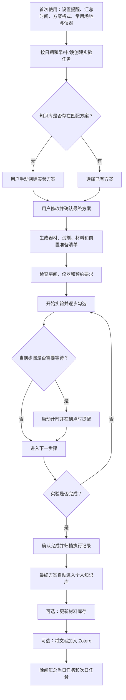

# LabFlow 实验日程助手：产品需求文档与技术栈

> 文档版本：V1.2  
> 更新日期：2026-07-28  
> 文档状态：产品方案已基本确认，技术方案已完成初审  
> 产品暂定名：LabFlow

## 0. 文档说明

本文档是 LabFlow 当前阶段的产品与技术单一事实来源，用于：

- 明确产品目标、用户、范围和业务规则；
- 划分 P0、P1、P2 功能优先级；
- 统一设计、开发和测试的交付依据；
- 记录推荐技术栈及部署方案；
- 标注尚未最终确认的产品决策和技术风险。

本文档定义“做什么、为什么做、如何验收”。具体 UI 稿、数据库表结构、接口定义和代码实现由对应部门另行交付。

---

# 第一部分：产品需求文档（PRD）

## 1. 产品背景

个人实验人员通常需要在日历、论文、教科书、实验记录、计时器、材料表格和仪器预约信息之间频繁切换。普通日程软件只能记录“什么时候做实验”，无法进一步支持实验方案调用、准备清单、步骤执行、等待计时、资源登记和知识沉淀。

LabFlow 希望以实验日程为入口，将实验前、实验中和实验后的工作连接成完整闭环。

## 2. 产品概述

### 2.1 产品定位

LabFlow 是面向个人实验人员的响应式 Web 实验工作台，将日程安排、实验方案、准备清单、步骤执行、计时提醒和实验知识库连接起来。

它不是单纯的日历，也不是单纯的文献问答工具。

### 2.2 产品形态

- 响应式 Web 应用；
- 电脑端侧重日程规划、资料导入、方案比较和知识库管理；
- 手机端侧重材料勾选、实验步骤执行、计时和提醒处理；
- 支持渐进式 Web 应用（PWA）形态。

### 2.3 首版目标用户

- 本科生；
- 研究生；
- 独立开展实验的科研人员；
- 其他需要个人管理实验任务和资料的实验人员。

首版仅提供个人空间，但产品和数据边界需允许后续升级为实验室团队空间。

### 2.4 核心价值

1. 让实验日程与实验方案直接关联。
2. 降低器材、试剂和材料遗漏的概率。
3. 通过步骤进度与计时提醒减少等待节点遗漏。
4. 将资料整理为统一、可复用、可追溯的实验方案。
5. 将最终执行方案及执行记录沉淀到个人知识库。
6. 逐步统一材料库存、仪器地点和预约记录。
7. 自动回顾当日任务并辅助安排次日工作。

## 3. 产品目标

### 3.1 核心目标

用户能够从创建实验日程开始，完成方案关联、材料准备、步骤执行、计时提醒、实验完成和方案归档的完整闭环。

### 3.2 产品成功指标

- 实验任务完整闭环完成率；
- 日程任务关联实验方案的比例；
- 准备清单使用率；
- 实验步骤清单使用率；
- 计时提醒处理率；
- 已完成方案自动归档成功率；
- 次日任务回访率。

具体数值目标应在小规模试用获得基线数据后确定。

### 3.3 非目标

首版不包括：

- 实验室成员协作；
- 机构级审批与管理；
- 论文、教科书或教程文件上传与解析；
- PDF/OCR、AI 方案提取、联网检索和多来源比较；
- RAG、向量检索、异步文档队列和 Python Worker；
- 自动替用户向机构预约系统提交申请；
- 自动替用户决定采用哪个实验方案；
- 对危险实验提供系统闹钟级安全保证；
- 用自动生成内容替代原始文献、导师意见或机构安全规范。

## 4. 用户分析

### 4.1 核心用户画像

典型用户需要独立安排多个实验，常在电脑端查资料和制定方案，并在实验台旁使用手机查看步骤、勾选清单和启动计时。

### 4.2 用户痛点

1. 日程和实验方案分散，开始实验前仍要重新查找资料。
2. 器材、试剂和材料准备依赖记忆，容易遗漏。
3. 等待步骤需要人工计时，容易错过处理节点。
4. 不同资料中的方案格式不一致，难以比较。
5. 已完成方案缺少统一归档，重复实验仍需重新整理。
6. 材料储备、房间和仪器预约信息缺少统一入口。
7. 用户难以快速回顾当日进度并准备次日任务。

## 5. 核心用户流程



P0 仅支持手动创建、编辑、搜索和关联实验方案。文件导入、AI 提取、联网检索及多来源比较从 P1 开始提供。

## 6. 功能优先级

### 6.1 P0：首版必须功能

1. 个人账户与基础偏好；
2. 按日期和早、中、晚划分的实验日程；
3. 个人实验知识库；
4. 标准实验方案；
5. 器材、试剂、材料和前置准备清单；
6. 实验步骤进度与执行记录；
7. 单个及多个步骤计时提醒；
8. 实验完成、执行记录归档和方案自动沉淀；
9. 每日晚间自动汇总；
10. 基础数据安全、历史版本保护和个人数据导出；
11. 电脑端和手机端响应式体验；
12. 建议支持短时断网后的读取、勾选及待同步操作恢复，具体离线范围待产品确认。

P0 明确不包含文档上传、PDF/OCR、AI 内容提取、联网资料检索、三来源比较、RAG、pgvector、任务队列或 Python Worker。

### 6.2 P1：重要增强功能

1. 论文、教科书和教程导入；
2. 文档内容提取及统一方案格式化；
3. 联网检索与不少于三个独立来源的方案比较；
4. 方案字段级来源追溯、冲突展示和人工复核；
5. 材料库存、使用归档、低库存和临期提醒；
6. 房间、仪器及预约记录提醒；
7. 方案版本比较和历史恢复；
8. 私密资料处理及知识库混合检索。

### 6.3 P2：后续扩展功能

1. Zotero 等文献管理软件连接；
2. 团队空间、成员、角色和权限；
3. 团队共享方案、库存、房间和仪器；
4. 机构预约系统连接；
5. 实验耗时、材料消耗和任务完成趋势；
6. 基于历史记录的计划建议。

## 7. P0 功能需求

### 7.1 个人账户与偏好

**目标：** 保存用户个人数据和使用偏好。

**用户故事：** 作为个人实验人员，我希望设置提醒方式、晚间汇总时间和方案格式偏好，以便系统按我的习惯工作。

**操作流程：**

1. 用户注册或登录；
2. 设置通知权限、时区、晚间汇总时间和方案偏好；
3. 系统创建个人空间并保存设置；
4. 用户可随时修改设置。

**业务规则：**

- 个人数据默认仅本人可见；
- 保存 IANA 时区，不仅保存 UTC 偏移；
- 通知权限被拒绝时仍保留站内提醒；
- 用户可关闭晚间汇总。

**输入：** 登录信息、时区、提醒权限、汇总时间、方案格式偏好。

**输出：** 个人空间和用户偏好。

**异常情况：**

- 通知权限被拒绝；
- 登录链接失效；
- 时区变化；
- 设置保存失败。

### 7.2 实验日程

**目标：** 让用户按日期及早、中、晚规划实验。

**用户故事：** 作为实验人员，我希望像查看课表一样查看实验安排，并能快速调整任务。

**操作流程：**

1. 用户选择日期和早、中、晚时段；
2. 填写任务名称、具体时间、预计时长、优先级和备注；
3. 关联或稍后补充实验方案；
4. 保存任务；
5. 用户可编辑、取消、完成或重新安排。

**业务规则：**

- 支持日视图和周视图；
- 任务可设置具体开始时间；
- 逾期不等于完成；
- 未完成任务不得未经确认自动顺延；
- 取消任务需保留原因。

**输入：** 日期、时段、任务名称、预计时间、优先级、备注、关联方案。

**输出：** 实验任务和日程展示。

**异常情况：**

- 时间冲突；
- 任务保存失败；
- 任务已被其他设备修改；
- 关联方案已停用。

### 7.3 个人实验知识库与标准方案

**目标：** 统一保存、搜索和复用实验方案。

**用户故事：** 作为实验人员，我希望创建任务时直接调用已有方案，并能查看方案来源和历史版本。

**操作流程：**

1. 用户搜索知识库；
2. 查看方案摘要、来源和适用条件；
3. 选择方案并关联任务；
4. 必要时复制为新版本并修改；
5. 用户确认后用于当前实验。

**业务规则：**

- 方案包含目标、适用条件、器材、试剂、材料、前置准备、步骤、关键参数、注意事项和来源；
- P0 方案由用户手动创建、编辑和确认；
- 方案分为草稿、待复核、已确认、执行版本、已归档和已停用；
- 实验开始后冻结执行版本；
- 后续修改不得覆盖历史执行版本；
- 被历史任务引用的方案只能停用或隐藏，不能破坏历史记录。

**输入：** 方案内容、来源、标签、版本说明。

**输出：** 可检索、可关联、可追溯的实验方案。

**异常情况：**

- 方案字段缺失；
- 可能存在重复方案；
- 来源无法访问；
- 删除方案时仍有历史任务引用。

### 7.4 准备清单

**目标：** 帮助用户确认实验前准备是否完整。

**用户故事：** 作为实验人员，我希望逐项勾选器材、试剂和材料，避免开始后才发现遗漏。

**操作流程：**

1. 系统根据方案生成清单；
2. 用户查看器材、试剂、材料和前置准备分类；
3. 用户逐项勾选、取消勾选或补充项目；
4. 系统显示完成数量和总体进度；
5. 用户确认进入实验。

**业务规则：**

- 每项支持名称、数量或规格、状态和备注；
- 用户可以修改自动生成内容；
- 未全部完成时允许开始，但必须提示；
- 勾选“已准备”不自动扣减库存。

**输入：** 方案清单和用户补充项目。

**输出：** 与当前实验任务绑定的准备状态。

**异常情况：**

- 清单未全部完成；
- 多设备同时修改；
- 页面刷新或短时断网；
- 项目被误删。

### 7.5 实验步骤与进度

**目标：** 记录实验执行过程并减少步骤遗漏。

**用户故事：** 作为实验人员，我希望按顺序执行并勾选步骤，同时保留完成时间和备注。

**操作流程：**

1. 用户开始实验；
2. 系统记录实际开始时间；
3. 用户查看当前步骤和注意事项；
4. 完成后勾选步骤；
5. 跳过步骤时填写原因；
6. 系统更新总体进度；
7. 所有必要步骤处理后，用户确认完成实验。

**业务规则：**

- 每个步骤包含说明、关键参数、预计耗时、注意事项和计时要求；
- 完成步骤时记录实际时间；
- 跳过步骤必须记录原因；
- 系统不得自动将整个实验标记为完成。

**输入：** 步骤状态、完成时间、备注和跳过原因。

**输出：** 实验进度和执行记录。

**异常情况：**

- 用户越过关键步骤；
- 离线操作尚未同步；
- 旧版本页面覆盖新状态；
- 归档前仍有未处理步骤。

### 7.6 步骤计时与提醒

**目标：** 在等待型步骤到期时及时提醒用户。

**用户故事：** 作为实验人员，我希望在培养基吹干、孵育或静置完成时收到提醒，并能继续、延后或调整时间。

**操作流程：**

1. 用户进入需要等待的步骤；
2. 使用方案预设时间或手动输入时间；
3. 启动计时；
4. 系统保存目标结束时间；
5. 到点后发送 Web Push，并写入站内提醒；
6. 用户选择完成、延后或修改时间；
7. 用户确认后继续下一步骤。

**业务规则：**

- 支持多个计时器并行；
- 支持开始、暂停、继续、延长、缩短和结束；
- 以目标结束时间作为事实来源，不依赖页面持续打开；
- 到点提醒不自动勾选步骤；
- Push 失败时保留站内提醒；
- 响应式 Web 默认只能承诺尽力分钟级送达，不承诺系统闹钟级实时性。

**输入：** 计时时长、目标结束时间、操作状态和对应步骤。

**输出：** 计时状态、到点提醒和处理记录。

**异常情况：**

- 浏览器未授权通知；
- 页面关闭或设备离线；
- Push 订阅失效；
- 多设备同时调整计时；
- 设备时间不准确。

### 7.7 实验完成与自动归档

**目标：** 保存完整执行记录并沉淀最终方案。

**用户故事：** 作为实验人员，我希望实验结束后自动保存我实际执行的方案和过程，以便后续复用。

**操作流程：**

1. 用户检查清单、步骤和计时状态；
2. 用户主动确认实验完成；
3. 系统记录实际完成时间；
4. 保存准备状态、步骤、计时和执行备注；
5. 将最终执行方案归档到知识库；
6. 用户可从历史任务重新打开记录。

**业务规则：**

- 只有用户主动确认才算完成；
- 执行方案采用不可变快照；
- 归档失败不得导致任务记录丢失；
- 重复方案由用户决定合并或保留。

**输入：** 最终任务状态、实际时间、执行方案和实验记录。

**输出：** 已完成任务、实验归档和知识库方案。

**异常情况：**

- 自动归档失败；
- 知识库存在相似方案；
- 用户误操作完成；
- 部分离线记录尚未同步。

### 7.8 每日晚间自动汇总

**目标：** 帮助用户回顾当天并准备次日任务。

**用户故事：** 作为实验人员，我希望每天晚上收到当日完成情况和次日任务摘要。

**操作流程：**

1. 到达用户设定的本地时间；
2. 系统生成当日任务状态快照；
3. 汇总已完成、进行中、未完成、已取消和次日任务；
4. 发送提醒并保留站内摘要；
5. 用户处理未完成任务。

**业务规则：**

- 未完成任务不得自动顺延；
- 用户选择顺延、改期或关闭；
- 当日无任务时遵循用户的空摘要偏好；
- 推送失败时，下次进入产品仍可查看摘要；
- 每个用户、日期和摘要类型只能生成一份有效摘要。

**输入：** 用户时区、汇总时间和任务状态。

**输出：** 每日摘要及待处理任务。

**异常情况：**

- 用户旅行或修改时区；
- 跨午夜；
- 重复执行；
- 推送失败；
- 汇总生成时任务正在修改。

### 7.9 数据导出与基础安全

**目标：** 确保用户能够控制个人实验数据。

**用户故事：** 作为实验人员，我希望导出个人任务和方案，并确保私密资料不会被其他用户访问。

**操作流程：**

1. 用户选择导出范围和格式；
2. 系统生成导出任务；
3. 用户下载结果；
4. 系统记录导出时间和范围。

**业务规则：**

- P0 支持 JSON 和 CSV；
- 重要删除、覆盖和替换操作需确认；
- P0 不生成或解析文档内容；
- P1 启用自动生成内容后，必须标明来源和待复核状态；
- 日志和错误信息不得泄露实验内容、凭据或私密资料。

**输入：** 导出范围、格式和用户身份。

**输出：** 可下载的数据文件和导出记录。

**异常情况：**

- 导出范围过大；
- 文件生成失败；
- 下载链接过期；
- 用户无权访问请求的数据。

## 8. P1 功能需求

### 8.1 资料导入与方案提取

- 支持论文、教科书章节和实验教程；
- 区分原始文件、提取文本、候选方案和最终确认方案；
- 无法确认的参数标记为“来源未说明”或“待确认”；
- 保存来源文件、版本、页码或章节、证据位置和提取时间；
- 私密资料不得进入其他用户的公共知识范围。

### 8.2 联网检索与多方案比较

- 正常情况下提供至少三个独立来源；
- 转载同一原始内容的网页不得计为多个独立来源；
- 比较适用对象、材料、关键参数、耗时、复杂度、风险和来源可信度；
- 来源不足三个时允许展示已有结果，但必须明确说明；
- 冲突内容并列展示，不自动裁决；
- 最终方案由用户选择、修改并确认。

### 8.3 材料管理库

- 字段包括名称、类别、规格、数量、单位、批次、制备日期、有效期、储存位置和备注；
- 状态包括可用、部分使用、已用尽、已过期和已报废；
- 标记已用时自动记录当前时间，并允许用户修改确认；
- 数量、耗尽和报废变化需用户确认；
- 数量单位不一致时不得自动合并；
- 支持低库存、临期和过期提醒。

### 8.4 房间、仪器和预约记录

- 用户可登记房间、仪器名称、仪器编号、地点和备注；
- 预约记录包括日期、开始时间、结束时间和状态；
- 状态包括待确认、已预约、已取消和已完成；
- 首阶段只管理预约记录和提醒；
- 不得把本地记录误表示为已向外部机构系统提交成功。

## 9. P2 功能需求

### 9.1 Zotero 连接

- 用户主动选择后才创建文献条目；
- 创建前展示条目并允许补充特殊字段；
- 作者、期刊、DOI 等缺失信息不得虚构；
- 检测可能重复的条目；
- 文献条目可回溯到采用它的实验方案。

### 9.2 团队空间

- 支持个人空间和团队空间；
- 角色建议包括所有者、管理员、编辑者和只读成员；
- 共享方案、库存、房间和仪器；
- 保留操作审计；
- 成员退出后不破坏团队历史记录；
- 个人方案复制到团队空间后需明确归属。

### 9.3 机构预约系统

- 通过独立连接器逐个适配机构；
- 外部提交失败不改变本地已确认事实；
- 保留外部预约编号、状态和同步时间；
- 允许用户人工修复或重新同步。

## 10. 核心业务状态

### 10.1 实验任务状态

- 待规划；
- 待准备；
- 待执行；
- 进行中；
- 等待中；
- 已完成；
- 已取消；
- 已逾期。

### 10.2 实验方案状态

- 草稿；
- 待复核；
- 已确认；
- 执行版本；
- 已归档；
- 已停用。

### 10.3 材料状态

- 可用；
- 部分使用；
- 已用尽；
- 已过期；
- 已报废。

### 10.4 预约状态

- 待确认；
- 已预约；
- 已取消；
- 已完成。

## 11. 通用业务规则

1. 系统不得仅因预计时间到达而自动完成实验。
2. 到点提醒不得自动完成实验步骤。
3. 历史执行方案不得被后续编辑覆盖。
4. 来源未说明的参数不得显示为已验证事实。
5. 自动整理的方案在用户确认前必须显示为待复核。
6. 高风险、生物安全、化学安全和设备安全步骤必须提示用户复核原始资料并遵守机构规范。
7. 用户未公开资料不得用于其他用户的公共知识库。
8. 用户确认最终方案前，系统不得代替用户作实验决策。
9. 未完成任务不得未经用户确认自动顺延。
10. 库存扣减、Zotero 建条目和外部预约提交均需用户确认。

## 12. 首版验收标准

### 12.1 完整闭环

用户能够：

1. 创建早、中或晚实验任务；
2. 关联并确认实验方案；
3. 勾选准备清单；
4. 开始实验；
5. 勾选步骤并启动计时；
6. 收到并处理提醒；
7. 主动确认完成；
8. 查看归档的执行记录和最终方案；
9. 在晚间摘要中查看完成状态。

关键记录丢失即不通过。

### 12.2 响应式体验

- 电脑端可完成规划、方案编辑和知识库管理；
- 手机端可完成清单、步骤、计时和任务完成；
- 主要操作无需横向滚动；
- 不得出现文字截断、控件重叠或主要操作被遮挡；
- 计时状态和当前步骤在手机端清晰可见。

### 12.3 数据与安全

- 个人数据默认仅本人可见；
- 重要操作需要确认；
- P0 知识库内容由用户手动创建和确认；
- P1 自动内容显示来源、冲突和待确认字段；
- 私密资料不会进入公共知识范围；
- 用户能够导出任务和方案；
- 错误信息不泄露资料正文或凭据。

### 12.4 提醒与异常

- 页面关闭后仍保存服务端计时事实；
- Push 不可用时保留站内提醒；
- 多计时器明确关联实验和步骤；
- 短时断网恢复后不会静默覆盖其他设备的新状态；
- 每日摘要不会重复生成或自动顺延任务。

---

# 第二部分：推荐技术栈

## 13. 技术方案结论

### 13.1 首选架构

采用“模块化单体 + 托管基础设施”：

- Next.js + React + 严格 TypeScript；
- 响应式 PWA；
- Supabase 作为核心后端平台；
- 前端和轻量服务端可部署到 Vercel 或 Sites；
- P0 运行时仅保留 Next.js 前端/PWA、部署平台和 Supabase；
- P0 不包含文档处理、AI/RAG、向量检索、任务队列或 Python Worker；
- P1 文档解析和 AI 长任务再增加 Supabase Queue、pgvector 和本地桌面 Python Worker；
- Docker 仅用于 Worker 的开发、测试、CI 和可选的实验室服务器部署，不要求普通用户安装；
- P0 不引入微服务、独立向量数据库、Redis 或自建消息系统。

### 13.2 Java Web 结论

Java Web 可以实现本产品，但不作为 P0 默认方案。

只有出现以下情况时才优先考虑 Spring Boot：

- 团队已有明显的 Java/Spring 能力；
- 已有成熟 Java 运维和容器平台；
- 复杂机构系统连接提前进入主线；
- 需要大量企业事务、批处理或内部系统集成。

如采用 Java 方案，建议：

- Next.js 继续负责响应式前端；
- Spring Boot 使用模块化单体；
- Spring Boot 部署到容器平台；
- Supabase 可继续承担 PostgreSQL、Storage 或部分认证能力；
- 不把 Spring Boot 部署到 Vercel Functions 或 Sites 的 Next.js 运行时。

## 14. 技术栈清单

### 14.1 P0 技术栈

P0 仅使用前端和 Supabase：

| 层级 | 首选技术 | 主要职责 |
|---|---|---|
| Web 框架 | Next.js App Router | 页面、SSR、轻量 BFF/API |
| 前端语言 | TypeScript（严格模式） | 前后端共享类型与可靠开发 |
| UI 运行形态 | React + 响应式 PWA | 电脑端与手机端统一体验 |
| Web 部署 | Sites 或 Vercel | 构建、版本、环境变量和生产发布 |
| 数据库 | Supabase PostgreSQL | 核心业务数据与唯一事实来源 |
| 用户认证 | Supabase Auth | 登录、会话和身份 |
| 权限控制 | Supabase RLS + 服务端校验 | 个人空间和未来团队空间隔离 |
| 定时任务 | Supabase Cron | 到期提醒领取和每日汇总 |
| 知识库搜索 | P0 PostgreSQL 全文搜索 | 方案标题、标签、来源和正文搜索 |
| 通知 | Web Push + Service Worker | 页面关闭后的尽力推送 |
| 提醒兜底 | 站内通知 | Push 失败、拒绝或设备离线后的补显 |
| 离线缓存 | IndexedDB + 待同步队列 | 短时离线读取、勾选和恢复 |
| E2E 测试 | Playwright | 桌面、手机和核心流程 |
| 单元/组件测试 | Vitest + React Testing Library | 核心逻辑和组件行为 |
| 数据库测试 | 权限、事务、幂等和迁移测试 | 防止越权和数据冲突 |

P0 不建设文件处理、AI 提取、联网检索、RAG 或独立后台 Worker。导出数据可由前端或轻量服务端按需生成，不建立文档处理流水线。

### 14.2 P1 新增技术

| 层级 | 首选技术 | 主要职责 |
|---|---|---|
| 私密文件存储 | Supabase Private Storage | 论文、教材和导出文件 |
| 任务队列 | Supabase Queue | 文档解析、OCR 和 AI 长任务 |
| 向量检索 | Supabase pgvector | 关键词与向量混合检索 |
| 文档处理 | 本地桌面 Python Worker | PDF、OCR、结构化提取和比较 |
| Worker 开发环境 | Docker | 开发、测试、CI 和服务器部署环境一致性 |
| AI 服务 | 经隐私和合规评审的模型服务 | 字段提取、候选方案整理和比较 |
| 错误监控 | Sentry 或同类平台 | 文档流水线错误、性能和队列积压 |

## 15. 关键技术边界

### 15.1 计时

- 数据库保存 `target_end_at` 等服务端时间事实；
- 页面仅根据目标结束时间计算显示；
- 暂停、继续和调整生成明确状态记录；
- 多设备修改使用版本号和冲突处理；
- 不以浏览器持续运行的倒计时作为唯一事实来源。

### 15.2 提醒

- Supabase Cron 定期领取到期通知任务；
- 通知任务使用幂等键避免重复；
- 失败按策略重试；
- Web Push 负责尽力送达；
- 站内通知负责兜底；
- 响应式 Web 不承诺危险实验的闹钟级实时保证。

### 15.3 P1 私密文件

- 使用私有存储桶；
- 文件和派生内容继承用户或空间权限；
- 上传时校验类型和大小；
- 进入解析前进行安全扫描；
- 不在日志中记录论文正文；
- 数据库备份与文件对象备份分别处理；
- 第三方 OCR 和模型供应商需满足隐私、保留和不训练要求。

### 15.4 P1 AI 与来源追溯

每个自动生成字段应保存：

- 来源文件；
- 文件版本；
- 页码、章节或定位符；
- 证据片段；
- 提取器版本；
- 模型版本；
- 生成时间；
- 复核状态。

系统不得用模型推断补全原文没有提供的实验参数。

### 15.5 团队升级

P0 即建立个人空间及空间归属，但界面仅开放个人空间。P2 在同一边界上增加成员、角色、共享范围和审计，避免届时迁移全部个人数据。

## 16. 分阶段技术计划

### 16.1 P0

1. 建立 Next.js、Supabase 和部署平台基线；
2. 完成环境隔离、数据库迁移、认证、个人空间和权限；
3. 完成日程、方案版本、准备清单、步骤执行和归档；
4. 完成目标时间型多计时器；
5. 完成 Web Push、站内提醒和晚间汇总；
6. 完成短时离线恢复、冲突处理和数据导出；
7. 完成权限、时间、离线、核心 E2E、监控和恢复验证。

P0 到此结束，不包含任何文档处理、AI、联网检索、向量检索或 Python Worker 工作。

### 16.2 P1

1. 增加私密文件上传、安全扫描和对象备份；
2. 增加 Supabase Queue 与本地桌面 Python Worker；
3. 完成 PDF、OCR、结构化提取和字段级来源追溯；
4. 完成 pgvector 混合检索；
5. 完成多来源去重、比较和冲突展示；
6. 完成材料、房间、仪器和预约记录。

P1 面向普通用户的正式交付方式为桌面安装包，不要求用户安装 Python 或 Docker。Docker 镜像和 Compose 配置保留为开发、测试、CI 及实验室服务器部署交付物。

### 16.3 P2

1. 增加 Zotero 连接器；
2. 开放团队空间、成员和权限；
3. 逐个接入机构预约系统；
4. 增加去标识化分析和趋势报告；
5. 根据实际负载评估云端 Worker、本地 Worker、团队部署及统一任务调度能力。

### 16.4 P1 本地桌面 Worker 要求

**产品定位：** Python Worker 是安装在用户电脑上的本地计算程序，负责文档解析、OCR、AI 提取和资料比较。普通用户只接触桌面安装包，不需要了解 Python、Docker、命令行、依赖库或环境变量。

**用户体验：**

1. 用户下载并安装 LabFlow Worker；
2. 用户启动程序并登录 LabFlow 账号；
3. Worker 在用户授权后连接 Supabase；
4. Worker 领取当前用户的待处理任务；
5. 在本地下载并处理文件；
6. 将结构化结果同步回 Supabase；
7. 网页端展示结果和处理状态；
8. 用户可暂停、退出或注销本地 Worker。

**标准工作流程：**

1. Worker 启动并完成用户身份验证；
2. 从 Supabase Queue 领取当前用户被授权的任务；
3. 下载待处理文件或数据；
4. 在本地执行 PDF、OCR、AI 提取或资料比较；
5. 将结构化结果写回 Supabase；
6. 更新任务状态并触发用户通知；
7. 失败任务按规则重试或进入人工处理状态。

**普通用户交付物：**

- Windows 安装包或可执行程序；
- macOS 应用安装包（进入 macOS 支持范围时提供）；
- 清晰的安装、登录、启动、暂停、退出和卸载说明；
- 可视化运行状态、任务进度和错误提示；
- 自动更新或明确的手动更新入口；
- 应用版本、兼容范围和最低系统要求；
- 代码签名及安装包完整性校验；
- 隐私、文件处理和本地缓存说明。

**开发与维护交付物：**

- Worker 源码及依赖锁定文件；
- Dockerfile；
- `docker-compose.yml` 或等价开发配置；
- 桌面打包和发布流程；
- 自动化测试和 CI 构建流程；
- Worker 版本管理和兼容规则；
- CPU、内存、磁盘和可选 GPU 要求；
- 日志、诊断、升级和回滚说明。

**Docker 使用边界：**

- Docker 用于开发、测试、CI 和可选的实验室服务器部署；
- 普通用户不需要安装 Docker Desktop 或 Docker Engine；
- 普通用户不需要安装 Python 或手动安装依赖；
- P1 默认采用本地桌面 Worker；
- P2 再评估云端 Worker、实验室 Docker Worker 和混合部署。

**安全规则：**

- 桌面程序、安装包、Docker 镜像和源码中不得包含 Supabase 密钥、模型 API Key 或其他固定凭据；
- Worker 必须使用当前登录用户的可撤销、最小权限凭据；
- 用户登录凭据应保存在操作系统安全凭据存储中，不写入普通配置文件；
- Worker 只能访问当前用户被授权的任务、文件和结果；
- 所有网络通信使用 TLS；
- 本地临时文件应有明确的保存位置、清理规则和用户删除入口；
- 日志不得记录论文正文、实验敏感内容、访问令牌或下载签名地址；
- 用户注销、设备丢失或设备不再可信时，必须可以撤销本地 Worker 的访问权限；
- 桌面程序应明确展示当前账号、设备和任务状态，防止共用电脑误处理其他用户任务。

**运行限制：**

- 用户电脑必须开机且 Worker 正在运行，任务才会被本地处理；
- 用户退出 Worker、电脑休眠或断网时，任务保持等待状态；
- 不使用云端 Worker 可以减少持续计算费用，但不能消除 Sites、Supabase、存储、网络或第三方模型 API 的潜在费用；
- 如果要求完全不产生模型 API 费用，需要另行评估本地模型及其硬件要求。

**异常处理：**

- Worker 离线时任务保留在队列中，不得丢失；
- 同一任务重复领取时应保证结果幂等；
- 处理失败需记录错误类别，不泄露敏感正文；
- Worker 版本不兼容时停止领取新任务并提示升级；
- 磁盘空间不足、OCR 依赖异常或模型服务不可用时进入可恢复失败状态；
- 本地文件清理失败时提示用户处理，不能静默长期保留私密资料。

---

# 第三部分：Sites 部署方案

## 17. 是否可以改用 Sites

可以，但需要满足兼容条件。

Sites 可以替换 Vercel，承担以下职责：

- 部署 Next.js Web/PWA；
- 管理生产环境变量；
- 保存网站版本；
- 发布生产版本；
- 管理公开、工作区或指定用户访问；
- 配置自定义域名。

Supabase 的职责不变：

- PostgreSQL；
- Auth；
- RLS；
- Cron；
- P1 再增加 Private Storage、Queue 和 pgvector。

P1 本地桌面 Worker 安装在用户电脑上，不由 Sites 替代。Docker 仅用于开发、测试、CI 和可选的实验室服务器部署。

## 18. Sites 兼容条件

1. Next.js 应构建为 Sites 支持的 OpenNext 或 vinext 部署产物；
2. 项目需包含有效的 `.openai/hosting.json`；
3. 首次创建 Sites 项目后，必须保存其真实 `project_id`，不得重复创建站点；
4. 生产环境变量应保存到 Sites 环境配置，不写入仓库；
5. 源码必须先推送，再按同一 Git 提交保存网站版本；
6. 只能部署已保存的网站版本；
7. 每个 Sites 部署地址均为生产地址；
8. 部署前需确认网站访问范围；
9. Supabase 跨域、认证回调和站点 URL 需加入最终 Sites 域名；
10. Service Worker、Web Push、SSR、API 路由和环境变量需在真实 Sites 运行环境完成验证。

## 19. 推荐部署决策

建议将部署层定义为可替换：

```text
Next.js / PWA
    ├── 方案 A：Sites（可选最终部署平台）
    └── 方案 B：Vercel（原始推荐平台）

Supabase
    ├── P0：PostgreSQL / Auth / RLS / Cron
    └── P1：Private Storage / Queue / pgvector

P1 本地桌面 Worker
    ├── Windows 安装包
    └── macOS 应用（进入支持范围时）

开发与扩展
    ├── Docker：开发 / 测试 / CI / 实验室服务器
    └── P2 云端 Worker：可选商业化模式
```

当前建议：

- 产品开发阶段避免使用只在 Vercel 存在的专有能力；
- P0 的定时任务、提醒领取和数据继续放在 Supabase；
- P0 仅部署前端/PWA 和 Supabase 相关连接，不部署文档处理服务；
- P1 的私密文件、Queue 和 pgvector 再加入 Supabase；
- Web 层保持标准 Next.js/OpenNext 兼容；
- 最终交付前同时验证 Sites 的构建、SSR、API 路由、PWA、Web Push 和环境变量；
- 如果 Sites 验证通过，可将其作为正式生产部署平台；
- 如果出现不兼容，再回退到 Vercel，而无需迁移数据库和核心业务数据。

## 20. Sites 部署流程

正式部署时应按以下顺序：

1. 检查 `.openai/hosting.json`；
2. 没有 `project_id` 时创建一次 Sites 项目并立即保存 ID；
3. 配置生产环境变量和访问权限；
4. 完成 Next.js/OpenNext 或 vinext 构建；
5. 验证桌面端、手机端、SSR、API、PWA、Push 和 Supabase 连接；
6. 将准确源码状态推送到 Sites 绑定的源码仓库；
7. 使用对应 Git 提交保存网站版本；
8. 部署已保存版本；
9. 检查部署状态直至成功或失败；
10. 完成生产域名、认证回调、跨域和核心闭环验收。

---

# 第四部分：部门交付

## 21. 设计部任务说明

设计部需覆盖：

- 首次使用与偏好设置；
- 今日工作台；
- 日程页；
- 实验任务编辑；
- 方案选择、详情与编辑；
- 实验准备；
- 实验执行；
- 计时中心；
- 个人知识库；
- 实验历史；
- 每日汇总；
- P1 的资料导入、多方案比较、材料管理和仪器预约；
- 桌面端、手机端及响应式状态；
- 正常、加载、空、错误、禁用、冲突、离线和恢复状态；
- 可访问性、键盘操作和焦点状态。

设计前需确认真实或代表性数据、视觉事实来源、Design Tokens 和必要素材。

## 22. 开发部任务说明

开发部需依据本文件输出：

- 技术规格；
- API Contract；
- 数据库与权限方案；
- 任务拆分和里程碑；
- P0 实现；
- 自动化测试和安全验证；
- Sites 或 Vercel 部署验证；
- P1 本地桌面 Worker 安装包、打包流程、版本规范和用户说明；
- Worker 开发用 Dockerfile、Compose 配置和 CI 文档；
- 开发报告和部署状态。

开发部不得自行修改产品范围、业务规则和优先级。

## 23. 测试部任务说明

测试部需覆盖：

- 完整实验闭环；
- 电脑端和手机端响应式流程；
- 权限和跨用户隔离；
- 计时、暂停、延长、跨午夜和多计时器；
- Push 被拒绝、失效、离线和站内补显；
- 多设备冲突和短时断网重放；
- 方案版本和历史保护；
- 归档失败和恢复；
- 每日汇总重复、漏发和时区变化；
- 私密文件权限；
- P1 AI 来源、冲突、缺失参数和三来源规则；
- P1 桌面 Worker 的安装、登录、运行、暂停、退出、升级和卸载；
- P1 桌面 Worker 在休眠、断网、磁盘不足和旧版本情况下的恢复；
- Sites 生产环境中的核心流程。

---

# 第五部分：风险与待确认项

## 24. 主要风险

1. Web Push 无法保证危险实验步骤准时到秒；
2. 时区、夏令时、跨午夜和旅行可能造成汇总重复或遗漏；
3. 离线重放和双设备修改可能引发状态冲突；
4. 权限策略错误可能造成跨用户数据泄露；
5. P1 AI 可能虚构参数或错误合并来源；
6. P1 私密论文可能经过存储、OCR 和模型供应商；
7. P1 数据库备份不等于文件对象备份；
8. P1 长文档处理可能超过普通 Web 函数限制；
9. 搜索、Zotero 和机构预约系统可能限流或失败；
10. Sites 兼容性必须在真实构建和生产运行环境中验证；
11. 本地 Worker 会在用户电脑保存临时文件和登录状态，需要明确清理及撤销机制；
12. Windows、macOS、CPU 架构、GPU、驱动和系统资源差异可能造成兼容问题；
13. 桌面安装包可能受到系统权限、杀毒软件、代码签名和后台运行策略影响；
14. 用户电脑关机、休眠、断网或退出 Worker 时，任务无法继续处理；
15. Worker 自动更新失败或旧版本长期运行可能造成处理结果不一致；
16. 不使用云端 Worker 只能减少持续计算费用，不能消除 Supabase、Sites、存储、网络或模型 API 费用。

## 25. 待产品确认

1. 提醒接受“尽力分钟级送达 + 站内补显”，还是要求增加短信、原生 App 等强提醒渠道；
2. P0 离线范围是仅查看和勾选，还是包含完整创建、编辑和计时；
3. 最低浏览器版本及 iOS 是否接受“添加到主屏幕”的使用要求；
4. 登录方式；
5. 数据驻留、资料保留和账户删除期限；
6. 私密论文允许的格式、大小、数量及第三方处理规则；
7. 三个独立来源的正式认定标准；
8. 自动方案采用整份确认还是字段级确认；
9. 数据导出是否包含原始论文、历史版本、审计和已删除数据；
10. 团队版角色、资源归属和成员退出后的处理；
11. 晚间汇总在旅行改时区时的处理方式；
12. P0 预计用户量、任务量和预算，以及 P1 预计文件量；
13. 最终部署平台选择 Sites 还是 Vercel；
14. Sites 网站访问范围是仅本人、指定成员、工作区还是公开访问；
15. P1 首先支持 Windows，还是同时支持 Windows 与 macOS；
16. 本地 Worker 的 CPU、内存、磁盘和可选 GPU 资源下限；
17. Worker 用户凭据的签发、撤销、有效期和权限范围；
18. 桌面安装包的发布渠道、代码签名、自动升级策略和版本兼容期限；
19. Worker 是否随系统启动，以及用户如何暂停后台处理；
20. AI 默认使用第三方模型 API 还是本地模型，以及可接受的费用与硬件要求；
21. 本地临时文件的默认保留时间和用户删除方式。

## 26. 当前结论

- 产品范围：已完成主要确认；
- P0/P1/P2：已完成划分；
- 核心流程和业务规则：已确认；
- 首版验收标准：已确认；
- 首选技术栈：Next.js + TypeScript + Supabase；
- P0 技术范围：仅前端/PWA、部署平台和 Supabase；
- P0 文档处理功能：明确不做；
- 文档上传、PDF/OCR、AI 提取、联网检索、RAG、pgvector、Queue 和 Python Worker：统一后移至 P1；
- P1 Worker 交付方式：冻结为本地桌面安装包，普通用户无需安装 Python 或 Docker；
- Docker 使用范围：开发、测试、CI 和可选的实验室服务器部署；
- P2 Worker 方向：评估云端 Worker、本地 Worker、团队部署和统一任务调度；
- Web 部署：Sites 和 Vercel 均保留，优先进行 Sites 兼容验证；
- Java Web：保留为具备明确团队或机构条件时的备选；
- 实际开发、设计和测试：尚未开始；
- Sites 项目：当前尚未创建；
- `.openai/hosting.json`：当前尚不存在。
