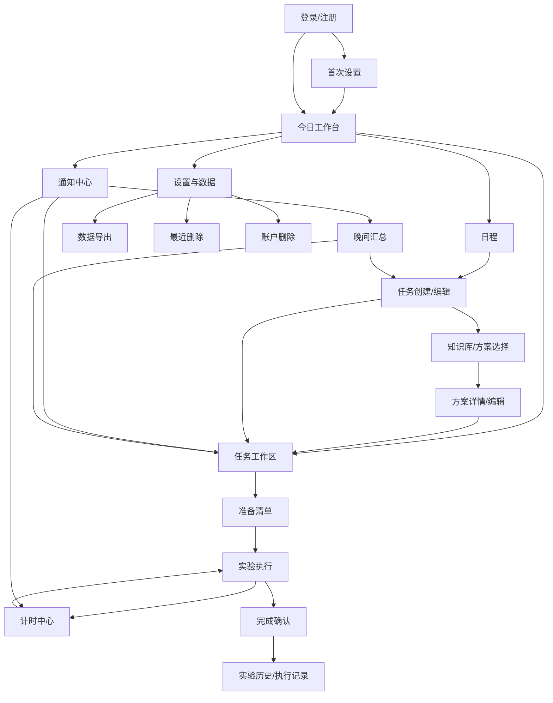

# LabFlow P0 / G1 用户体验与页面结构设计规格

> 版本：G1-Countersign-5  
> 日期：2026-07-29  
> 状态：G1 已正式通过并冻结；网页 UI 阶段等待 G2 通过后另行放行  
> 主责：设计部  
> 范围：P0 流程、信息架构、页面结构、交互状态与响应式规则  
> 不包含：视觉方向、高保真稿、Design Tokens、业务代码、真实数据接入

## 1. 文档目的

本文档将已冻结的 LabFlow P0 需求转化为可评审、可实现、可测试的用户体验结构，作为 G1 联合评审输入。

本轮完成的定义包括：

- 用户如何进入产品并完成首次设置；
- 用户如何安排实验、关联方案并进入准备；
- 用户如何在实验台旁执行步骤、处理多个计时器与提醒；
- 用户如何完成归档、查看历史和处理晚间汇总；
- 页面如何组织、关联并适配桌面端与移动端；
- 正常、加载、空、错误、禁用、离线、冲突及通知不可用时如何呈现；
- 后续静态页面所需的代表性固定数据和设计验收基线。

视觉语言、色彩、字体、图标、间距、组件外观和高保真事实来源需在产品部确认本文件后另行设计。

## 2. 事实来源与优先级

本规格依据以下文件：

1. `LABFLOW_P0_FROZEN_BASELINE.md`，作为 P0 冻结范围和业务规则的最高优先级来源，其中第 8 节关闭本规格的 `PD-01` 至 `PD-12`，第 9 节冻结与设计展示相关的逾期、纯文本、导出和访问边界；
2. `LABFLOW_PRD_AND_TECH_STACK.md` V1.2，作为产品目标、用户故事和通用规则来源；
3. `docs/superpowers/plans/2026-07-29-labflow-cross-department-execution.md`，作为 G1 交付和跨部门会签依据；
4. `UI_UX_DESIGNER_AGENT.md`，作为设计部职责边界和交付规则。

如文档存在冲突，以冻结基线为准；设计部不自行改变产品范围或业务规则。

## 3. 需求理解

### 3.1 产品与用户

LabFlow P0 是面向个人实验人员的响应式 Web/PWA 实验工作台。用户通常在桌面端规划日程、维护实验方案，在移动端完成准备勾选、步骤执行、计时与提醒处理。

核心问题不是“记录一个日历事件”，而是让一个实验任务从计划进入准备、执行、等待、完成和归档，并在全过程保留可恢复、可追溯的状态。

### 3.2 P0 核心闭环

```text
注册或登录
→ 完成首次偏好设置
→ 按日期及早/中/晚创建实验任务
→ 关联已有方案或手工创建方案
→ 确认任务使用的方案版本
→ 勾选准备清单
→ 开始实验并执行步骤
→ 启动和处理多个计时器
→ 主动确认完成
→ 保存执行记录并归档方案快照
→ 在历史和晚间汇总中回顾
```

### 3.3 体验目标

1. **始终知道下一步。** 每个任务清晰显示当前阶段、阻塞原因和推荐行动。
2. **实验台旁低认知负担。** 移动端优先显示当前步骤、关键参数、注意事项、计时状态和单一主要操作。
3. **重要事实不被自动改变。** 到点不自动完成步骤，逾期不自动完成任务，未完成任务不自动顺延。
4. **弱网络下不误导。** 离线、待同步、冲突和只读限制持续可见，不将本地推算伪装成已同步事实。
5. **提醒有明确能力边界。** Push 不可用时提供站内补显，并明确 LabFlow 不能替代安全制度、专用报警设备或人工值守。
6. **历史可以信任。** 执行版本和完成记录不可被后续方案编辑覆盖。

### 3.4 P0 明确排除

本规格不包含以下页面、入口或占位功能：

- 文件上传、PDF/OCR 和文档处理；
- AI 方案提取、RAG、联网检索和多来源比较；
- 材料库存管理；
- 仪器、房间和预约管理；
- Python Worker、Docker 或桌面安装程序；
- Zotero；
- 团队空间、成员、角色和共享；
- 危险实验的闹钟级安全保证。

## 4. 结构方案与取舍

### 4.1 方案比较

| 方案 | 描述 | 优点 | 风险 |
|---|---|---|---|
| A：任务工作区驱动（推荐） | 规划、知识库、历史保持独立；准备、执行、计时和归档围绕同一实验任务工作区展开 | 上下文连续；移动端跳转少；容易展示任务阶段和历史快照 | 任务工作区需要清晰分层，避免单页过载 |
| B：每阶段独立页面 | 准备、步骤、计时、完成均为独立主页面 | 页面职责单一 | 实验台旁频繁跳页；跨页面状态易割裂 |
| C：今日工作台集中 | 主要能力全部嵌入今日页 | 首屏直接 | 多任务和多计时器下信息拥挤；知识库与历史难以扩展 |

### 4.2 采用方案

采用方案 A，并使用“稳定主导航 + 任务阶段视图”的混合结构：

- 主导航承载今日、日程、知识库和历史；
- 当前实验任务使用稳定任务工作区，内部按概览、准备、执行和记录组织；
- 计时中心和通知中心作为全局工具，可从任何主页面进入；
- 设置、导出和最近删除归入账户与数据管理；
- 桌面端允许并排显示任务上下文，移动端一次聚焦一个任务阶段。

该方案不改变任何业务规则，仅决定信息如何组织和呈现。

## 5. 信息架构

```text
LabFlow
├─ 账户入口
│  ├─ 注册与邮箱验证
│  ├─ 登录
│  └─ 找回/重置密码
├─ 首次设置
│  ├─ 时区
│  ├─ 晚间汇总
│  ├─ 通知说明与授权
│  └─ 方案格式偏好
├─ 今日工作台
│  ├─ 当前/下一实验
│  ├─ 今日早/中/晚任务
│  ├─ 活跃计时器
│  ├─ 待处理提醒
│  └─ 晚间汇总入口
├─ 日程
│  ├─ 日视图
│  ├─ 周视图
│  └─ 任务创建/编辑/改期/取消
├─ 实验任务工作区
│  ├─ 概览与方案版本
│  ├─ 准备清单
│  ├─ 实验执行
│  └─ 完成与记录
├─ 个人知识库
│  ├─ 搜索与筛选
│  ├─ 方案详情与版本
│  └─ 手工创建/编辑/停用
├─ 全局工具
│  ├─ 计时中心
│  └─ 通知中心
├─ 历史
│  ├─ 实验历史
│  └─ 不可变执行记录
├─ 晚间汇总
│  ├─ 当日状态
│  └─ 次日任务
└─ 设置与数据
   ├─ 账户
   ├─ 时区与晚间汇总
   ├─ 通知
   ├─ 方案偏好
   ├─ 数据导出
   ├─ 最近删除
   └─ 账户删除
```

## 6. 导航模型

### 6.1 桌面端

主导航固定包含：

1. 今日
2. 日程
3. 知识库
4. 历史

全局工具位于持续可见的应用框架中：

- 活跃计时器入口，显示运行中或已到点数量；
- 通知入口，显示未读数量；
- 账户菜单，进入设置、导出、最近删除和退出。

当前任务工作区不是新的全局一级栏目，用户从今日、日程、提醒、计时器或历史记录进入，以保持“任务是业务上下文，不是独立内容库”的心智模型。

### 6.2 移动端

底部主导航固定包含：

1. 今日
2. 日程
3. 当前实验
4. 知识库
5. 更多

“当前实验”位置保持稳定：

- 有进行中或等待中任务时，进入该任务的执行视图；
- 没有当前实验时，显示解释性空状态和最近可开始任务；
- 不因是否存在任务而隐藏或移动导航项。

活跃计时器以紧凑状态条持续显示在主内容与底部导航之间；通知入口位于页面顶部应用栏。“更多”包含历史、晚间汇总、设置、导出和最近删除。

### 6.3 公开入口与个人数据访问

- Sites 使用公开网站入口；登录、注册、邮箱验证和找回密码页面可在未登录状态访问；
- 今日、日程、任务工作区、知识库、计时、通知、历史、汇总、设置、导出和最近删除均要求登录；
- 未登录用户打开受保护地址时，先进入登录；登录成功且有权访问后可返回原目标；
- 公开入口、错误页和登录前页面不得展示任何用户实验数据；
- 个人业务数据只在登录后展示，并由当前账户和个人空间隔离；
- 账户处于 7 天删除撤销期时，登录后只进入 C01 账户待删除页面；
- Sites M0 失败而回退 Vercel 时，页面信息架构、访问边界和业务表达保持不变。

## 7. 页面清单与页面目标

| ID | 页面/视图 | 目标 | 主要入口 | 主要去向 |
|---|---|---|---|---|
| A01 | 登录 | 使用邮箱和密码进入个人空间 | 公开入口、会话失效 | 今日、找回密码、注册 |
| A02 | 注册与邮箱验证 | 创建账户并确认邮箱 | 登录页 | 首次设置、重新发送验证 |
| A03 | 找回/重置密码 | 恢复账户访问 | 登录页、失效链接 | 登录 |
| O01 | 首次设置 | 完成时区、汇总、通知和方案偏好 | 首次登录 | 今日 |
| D01 | 今日工作台 | 汇总今天最需要处理的任务、计时器和提醒 | 登录后默认、主导航 | 任务工作区、日程、计时、通知、汇总 |
| S01 | 日程日/周视图 | 按日期及早中晚查看和安排任务 | 主导航 | 新建任务、任务工作区 |
| S02 | 任务创建/编辑 | 创建、编辑、改期或取消实验任务 | 今日、日程、任务工作区 | 方案选择、任务工作区 |
| W01 | 任务概览 | 显示任务阶段、时间、状态、关联方案及下一步 | 今日、日程、提醒 | 准备、执行、编辑、方案详情 |
| W02 | 准备清单 | 勾选器材、试剂、材料和前置准备 | 任务概览 | 执行、任务概览 |
| W03 | 实验执行 | 按步骤完成、取消完成、跳过、备注和启动计时 | 任务概览、当前实验 | 计时中心、完成确认 |
| W04 | 完成确认 | 检查未处理步骤、计时与待同步状态后主动完成 | 实验执行 | 历史记录、归档恢复 |
| K01 | 知识库 | 搜索、筛选和复用个人实验方案 | 主导航、任务关联 | 方案详情、方案编辑 |
| K02 | 方案详情与版本 | 查看方案内容、来源、状态、版本和引用关系 | 知识库、任务概览 | 关联任务、复制版本、编辑 |
| K03 | 方案创建/编辑 | 手工维护标准方案并确认可执行版本 | 知识库、任务创建 | 方案详情、任务关联 |
| T01 | 计时中心 | 统一查看和处理多个任务/步骤计时器 | 全局入口、实验执行 | 对应步骤、提醒处理 |
| N01 | 通知中心 | 查看未读、错过和 Push 降级后的站内提醒 | 全局入口 | 任务、步骤、计时器、汇总 |
| H01 | 实验历史 | 查找已完成和已取消实验 | 主导航/更多 | 执行记录 |
| H02 | 执行记录 | 查看不可变方案快照、准备、步骤、计时和备注 | 历史、归档结果 | 关联方案版本 |
| M01 | 晚间汇总 | 回顾当日状态并查看次日任务 | 今日、通知、更多 | 任务详情、任务改期 |
| P01 | 设置 | 管理账户、时区、汇总、通知和方案偏好 | 账户菜单/更多 | 通知授权、数据管理 |
| X01 | 数据导出 | 选择 JSON/CSV 范围并下载结果 | 设置 | 导出状态、重新生成 |
| R01 | 最近删除 | 在 30 天保留期内查看和恢复软删除记录 | 设置 | 恢复结果、永久删除说明 |
| C01 | 账户删除 | 告知 7 天撤销期及 30 天内永久删除规则 | 设置 | 删除确认、撤销入口 |

## 8. 页面关系



## 9. 核心用户流程

### 9.1 注册、登录与首次设置

1. 用户选择注册，输入邮箱与密码。
2. 系统提示验证邮箱；用户可重新发送验证邮件。
3. 验证后进入首次设置。
4. 系统建议当前 IANA 时区，用户确认或修改。
5. 用户确认默认 21:00 晚间汇总，可修改或关闭。
6. 系统先解释通知用途、尽力送达边界和站内补显，再由用户主动触发浏览器授权。
7. 用户选择方案格式偏好并完成设置。
8. 进入今日工作台。

异常分支：

- 邮件链接失效：解释原因并提供重新发送；
- 离线：注册、登录和找回密码不可用；
- 通知被拒绝或平台不支持：不阻断首次设置，转为站内提醒；
- 设置保存失败：保留已填写内容并提供重试，不进入完成态。

### 9.2 创建日程任务

1. 用户从今日或日程选择日期及时段。
2. 输入任务名称、日期、早/中/晚时段；可选填写精确开始时间、精确结束时间、关联方案和备注。
3. 选择“关联已有方案”“手工创建方案”或“稍后关联”。
4. 若时间与其他任务重叠，显示冲突摘要；用户明确确认后可以保存。
5. 系统不得自动改期、缩短任务或替用户选择保留哪一个任务。
6. 保存后进入任务概览，并显示任务当前阶段和下一步。
7. 改期必须由用户主动确认；系统不自动顺延。
8. 取消任务时必须填写原因并保留历史。

移动端使用单日和早/中/晚分组列表，不压缩周网格；桌面端提供日/周切换。

任务字段：

- 必填：任务名称、日期、早/中/晚时段；
- 选填：精确开始时间、精确结束时间、关联方案、备注。

任务状态转换：

- 用户显式操作：开始、暂停当前执行、继续、取消、确认完成、撤销完成；
- 待规划：未关联已确认方案；
- 待准备：已关联方案，但准备清单尚未全部完成；
- 待执行：已具备执行条件且尚未开始；
- 进行中：已开始，且没有处于等待中的活动计时器；
- 等待中：已开始，且至少一个关联计时器正在运行或暂停等待；
- 已逾期：计划结束时间或所在时段已过，且尚未完成或取消；
- 已完成：用户确认完成；
- 已取消：用户确认取消。

同时满足多个条件时，状态优先级固定为：已完成/已取消 > 已逾期 > 等待中 > 进行中 > 待执行 > 待准备 > 待规划。

逾期展示边界：

- 全部时间按任务所属日期及用户当时设置的 IANA 时区计算；
- 早时段为 00:00–11:59；未填写精确结束时间时，从 12:00 起显示已逾期；
- 中时段为 12:00–17:59；未填写精确结束时间时，从 18:00 起显示已逾期；
- 晚时段为 18:00–23:59；未填写精确结束时间时，从次日 00:00 起显示已逾期；
- 填写精确结束时间时，以精确结束时间作为逾期边界；
- 逾期只改变显示状态，不自动取消、完成、改期或顺延任务。

### 9.3 手工创建或关联实验方案

关联已有方案：

1. 从任务编辑或任务概览打开方案选择。
2. 搜索标题、标签、来源或正文。
3. 查看适用条件、状态、版本和来源。
4. 若方案已停用，只允许查看历史，不允许新关联。
5. 选择明确版本并关联任务。

手工创建方案：

1. 输入方案名称和至少一个实验步骤；每个步骤必须有名称或可执行说明，并设置“必要/可选”，默认必要。
2. 简介、标签、来源说明、器材、试剂、材料、前置准备、默认时长、计时提醒、注意事项和备注均为选填。
3. 新建方案默认为草稿；用户可以直接确认，也可以主动标记为待复核。
4. 待复核方案由用户确认后进入已确认。
5. 日程可暂时关联草稿或待复核方案，但开始实验前必须切换到已确认版本。
6. 缺少必要字段时在字段附近提示，不仅在页面顶部显示错误。
7. 检测到相似方案时提示查看已有方案，但不自动合并。
8. 用户确认方案后返回任务。
9. 实验开始时冻结该任务的执行版本。

方案状态：

- 草稿：新建方案的默认状态；
- 待复核：用户主动标记需要进一步复核；
- 已确认：可以用于开始实验；
- 执行版本：实验开始时冻结的版本；
- 已归档：实验完成后保存的最终执行方案；
- 已停用：不能用于新实验，但不影响历史引用。

### 9.4 准备清单

1. 任务依据关联方案生成四组清单：器材、试剂、材料、前置准备。
2. 页面显示总进度和每组进度。
3. 用户逐项勾选、取消勾选、填写规格/数量和备注，并可补充项目。
4. 刷新或重新登录后保留状态。
5. 未全部准备完成时允许继续，但开始实验前必须明确提示未完成数量。
6. 用户确认仍要开始后进入执行；系统记录开始当时未完成准备项的快照，不要求填写自由文本原因。

离线时只允许勾选和取消勾选，操作标记为“待同步”；新增、编辑和删除准备项不可用。

### 9.5 实验步骤执行

1. 用户主动选择“开始实验”，系统记录实际开始时间并冻结执行方案版本。
2. 页面聚焦当前步骤，同时保留全部步骤进度入口。
3. 当前步骤显示说明、关键参数、预计耗时、注意事项和计时要求。
4. 用户可以：
   - 完成步骤并记录实际时间；
   - 取消完成；
   - 添加或修改执行备注；
   - 跳过步骤并填写必填原因；
   - 对需要等待的步骤启动计时器。
5. 系统更新总体进度，但不自动完成实验。
6. 高风险或安全相关提示使用持续可见的警示内容，要求用户复核原始资料并遵守机构规范。

离线时可完成或取消完成步骤，也可跳过步骤；跳过原因必填，并与跳过事件一起标记为“待同步”。原因为空时不得保存。离线时不能启动、暂停或调整计时器。

### 9.6 多计时器与提醒

1. 用户从需要等待的步骤输入或采用预设时长。
2. 启动前确认对应实验和步骤。
3. 计时中心按状态分组显示已到点、运行中、已暂停和已结束的计时器。
4. 每个计时器必须显示：
   - 实验任务；
   - 对应步骤；
   - 目标结束时间；
   - 当前状态；
   - 可用操作。
5. 用户可开始、暂停、继续、延长、缩短和结束计时。
6. 到点时写入站内提醒；Push 可用时同时尽力推送。
7. 到点不自动完成步骤，用户选择“返回步骤”“延后”或“结束计时”。
8. 页面刷新或换设备后，剩余时间依据目标结束时间恢复。

离线时只显示基于已缓存目标结束时间的本地推算，并明确标注“离线推算”；所有计时修改操作禁用。

### 9.7 完成、归档与历史

1. 用户进入完成确认。
2. 系统汇总准备清单、步骤、跳过原因、活动计时器、执行备注、待同步状态和方案版本。
3. 系统检查完成条件：
   - 存在待同步操作时阻断；
   - 存在未解决冲突时阻断；
   - 存在仍在运行或暂停但未结束的计时器时阻断；
   - 存在未完成且未按规则跳过的必要步骤时阻断；
   - 可选步骤未处理时只警告；
   - 准备项未全部完成时只警告，因为开始实验时已保留准备快照。
4. 只有用户主动确认后，任务才标记为已完成。
5. 系统先保存任务完成和执行记录，再尝试将最终执行方案归档到知识库。
6. 归档成功：进入执行记录，并显示不可变方案快照。
7. 归档失败：任务记录不得丢失；显示“实验已完成，方案归档待恢复”，提供重试入口。
8. 知识库存在相似方案时，用户可以查看相似方案，并选择继续保留为独立方案，或放弃新建并返回已有方案。
9. P0 不提供方案字段合并或自动合并。

历史执行记录只读。后续方案编辑不得改变该次实验的方案版本、清单、步骤、计时和备注。

用户可在完成后 30 天内从执行记录选择“撤销完成”。撤销后二次确认，恢复为完成前的执行状态，并保留原完成时间、撤销时间和操作记录。超过 30 天后不显示普通用户撤销入口；撤销完成不是删除历史。

### 9.8 晚间汇总与次日任务

1. 系统按当前 IANA 时区和用户设置时间生成一次有效汇总。
2. 汇总按已完成、进行中、未完成、已取消和次日任务分组。
3. 未完成任务仅展示状态，不自动顺延、关闭或完成。
4. 用户可进入任务详情，或主动选择改期。
5. Push 失败时，汇总仍出现在通知中心和今日工作台。
6. 用户修改时区后，未来汇总按新时区生成，已经生成的当地日期不重复。
7. 当日和次日均无任务时仍生成站内空摘要，显示“今日暂无任务记录，明日暂无安排”，但不发送 Web Push。
8. 任一日期存在任务时，按用户通知偏好尝试 Push，并始终保留站内汇总。

### 9.9 数据导出

1. 用户选择 JSON 或 CSV。
2. JSON 包含当前账户内可迁移的 P0 结构化数据，以及仍在 30 天保留期内的软删除对象；软删除对象明确包含 `deleted_at`、可恢复截止时间和对象状态。
3. CSV 明确生成日程任务、实验方案、实验执行记录三个表格，只包含当前有效对象，不包含软删除对象。
4. 已永久删除对象不得出现在 JSON 或 CSV 中。
5. 用户确认导出。
6. 页面显示生成中、可下载、生成失败和链接过期状态。
7. 导出文件说明生成时间和数据版本。
8. 离线时不可创建导出。

### 9.10 删除与恢复

1. 未完成的日程任务、未被历史执行锁定的实验方案逻辑实体可进入最近删除并保留 30 天。
2. 最近删除按剩余保留天数展示可恢复记录。
3. 已完成实验执行记录不得软删除，只能归档和查看。
4. 已被实验执行引用的方案版本不得删除；方案逻辑实体可停用，但历史版本必须保留。
5. 准备项、实验步骤和计时器不提供独立恢复入口，随所属未完成任务一并恢复。
6. 站内提醒和晚间汇总不进入最近删除。
7. 账户删除前明确说明 7 天撤销期及之后 30 天内完成永久删除。
8. 用户发起账户删除后立即退出正常业务界面。
9. 7 天撤销期内可使用原邮箱和密码登录；登录后只显示“账户待删除”页面，不加载普通业务首页。
10. 用户可以二次确认撤销删除并恢复正常账户，或退出并维持删除计划；系统记录撤销时间。
11. 账户删除和永久删除均使用高风险确认，不与普通记录删除共用轻量确认样式。

## 10. 页面结构规则

### 10.1 今日工作台

信息优先级：

1. 已到点提醒和需要立即处理的冲突；
2. 当前实验和当前步骤；
3. 活跃计时器；
4. 今日早/中/晚任务；
5. 待准备与逾期任务；
6. 晚间汇总或次日预览。

工作台不展示 P1 能力入口，不使用“即将上线”卡片占用核心空间。

### 10.2 日程

- 桌面周视图按日期列、早/中/晚分区展示，具体时间作为任务内信息；
- 桌面日视图按早/中/晚分组，并允许更完整的任务摘要；
- 移动端默认单日列表，上方使用可横向切换的日期条，任务内容本身不要求横向滚动；
- 已逾期、已取消和已完成必须用文本状态配合视觉差异，不只依赖颜色；
- 时间冲突必须同时指出涉及的任务和重叠时段。

### 10.3 任务工作区

任务工作区持续显示：

- 任务名称、日期和时段；
- 任务状态及阶段；
- 关联方案和执行版本；
- 总体进度；
- 离线、待同步或冲突状态；
- 当前阶段的主要操作。

阶段导航顺序固定为“概览—准备—执行—记录”。未到达的阶段可查看摘要，但修改能力由业务状态决定。

### 10.4 实验执行

移动端首屏优先：

1. 当前步骤序号和总体进度；
2. 步骤说明；
3. 关键参数；
4. 安全/注意事项；
5. 计时状态；
6. 完成、跳过和备注操作。

全部步骤列表不得挤压当前步骤，可通过抽屉或独立列表视图打开。完成和跳过是不同语义，不共用一个切换控件。

### 10.5 计时中心

- 已到点计时器排在最前；
- 运行中计时器按目标结束时间排序；
- 每个计时器始终显示对应任务和步骤；
- 延长、缩短和结束必须作用于明确选中的计时器；
- 结束计时不等于完成步骤；
- 活跃计时器数量较多时使用列表，不使用难以读取的圆形仪表盘集合。

### 10.6 纯文本正文

- 任务备注、方案简介、步骤说明、跳过原因和一般文本字段统一使用纯文本；
- P0 不提供 Markdown、HTML、富文本编辑器、嵌入脚本或自定义样式；
- 用户输入的换行在编辑和只读展示中保留；
- 类似 Markdown 或 HTML 的字符按普通文本显示，不解析、不执行；
- 器材、试剂、材料、步骤和计时等结构化内容使用独立字段或列表，不依赖正文标记语法；
- 超长纯文本遵循换行、展开/收起和可访问性规则，不因禁用富文本而截断内容。

## 11. 响应式规则

### 11.1 断点建议

| 模式 | 建议宽度 | 主要布局 |
|---|---:|---|
| 手机 | 320–767 px | 单列、底部导航、全屏编辑流程、底部固定主要操作 |
| 紧凑/平板 | 768–1023 px | 单列或主内容 + 可收起上下文面板 |
| 桌面 | ≥1024 px | 左侧主导航 + 主内容；需要时增加右侧上下文面板 |

用于 G3 截图验收的最低代表视口：

- 桌面：1440 × 900；
- 手机：390 × 844；
- 额外边界检查：320 px 宽度和 200% 页面缩放。

最终断点需由设计部与开发部在 G2 会签，但不得改变以下行为规则。

### 11.2 通用行为

- 主要任务流程不得要求页面级横向滚动；
- 导航、内容和固定操作必须考虑移动端安全区；
- 移动端弹窗改为全屏页或底部面板，避免小屏嵌套弹窗；
- 虚拟键盘打开时，不得遮挡当前输入和提交操作；
- 长标题、长方案名称、长步骤说明和长错误信息必须换行；
- 固定底部操作不得遮挡最后一项内容；
- 桌面双栏在窄屏降为单列，内容阅读顺序保持一致；
- 触控目标至少 44 × 44 CSS px；
- 表格在移动端转换为分组卡片或定义列表，不压缩到不可读。

### 11.3 页面差异

| 页面 | 桌面端 | 移动端 |
|---|---|---|
| 今日 | 可并排显示任务与计时/提醒上下文 | 单列，紧急状态和当前实验优先 |
| 日程 | 日/周视图；周视图为主要规划模式 | 默认单日列表；日期条切换 |
| 任务编辑 | 对话框或侧面板，保留日程上下文 | 全屏流程，分组字段 |
| 知识库 | 搜索列表与详情可双栏 | 列表与详情分层进入 |
| 方案编辑 | 分区表单，可显示结构目录 | 单列分步或折叠分区，保持字段顺序 |
| 准备清单 | 分类与进度可并排 | 单列，分类吸顶，勾选优先 |
| 实验执行 | 步骤列表与当前步骤并排 | 当前步骤优先，全部步骤按需展开 |
| 计时中心 | 多计时器完整列表与筛选 | 已到点和运行中优先，单列卡片 |
| 历史记录 | 列表与记录详情可双栏 | 先列表后详情，只读内容分组 |
| 设置/导出 | 分类侧栏 + 详情 | 分层列表，危险操作独立区 |

## 12. 状态设计

### 12.1 全局状态表达规范

每个非正常状态至少说明：

1. 发生了什么；
2. 当前数据是否安全、是否已保存；
3. 用户现在可以做什么；
4. 是否存在替代路径。

状态不得只依赖颜色或图标。禁用控件必须提供原因；错误信息不得泄露实验正文、凭据或其他用户数据。

### 12.2 状态矩阵

| 区域 | 正常 | 加载 | 空 | 错误 | 禁用 | 离线 | 冲突 |
|---|---|---|---|---|---|---|---|
| 登录/注册 | 可提交表单 | 提交按钮显示进行中并防重复 | 不适用 | 字段错误或通用失败，保留非敏感输入 | 输入不完整、链接失效 | 明确不可登录/注册 | 不适用 |
| 首次设置（O01） | 按顺序设置时区、汇总、通知和方案偏好 | 加载当前偏好或保存步骤时保留已填内容 | 不适用 | 保存失败时停留当前步骤、保留输入并提供重试 | 必填项不完整或正在保存时禁用继续 | 不允许完成或保存首次设置 | 多设备偏好变化时提示刷新并重新确认 |
| 今日 | 显示今日任务、当前实验、计时与提醒 | 使用结构占位，保留页面框架 | 提供创建首个任务 | 保留可用缓存并提供重试 | 依任务状态解释操作限制 | 显示缓存时间和只读/可同步范围 | 冲突置顶，指向具体任务 |
| 日程 | 日/周任务完整显示 | 保留日期与时段骨架 | 当前日期无任务，提供创建 | 局部失败不清空其他日期 | 离线时创建/编辑/改期禁用 | 可查看已缓存的当天和次日内容 | 指出两份版本及处理入口 |
| 任务编辑 | 可保存 | 保存中防重复提交 | 不适用 | 保留字段并聚焦首个错误 | 离线、已完成或无权限时禁用 | 不允许创建或编辑 | 提供刷新/保留服务器版本；不得静默覆盖 |
| 任务概览（W01） | 显示阶段、状态、方案版本、进度和下一步 | 各区块独立加载并保留任务标题 | 未关联方案时显示明确下一步，不伪装为加载失败 | 局部加载失败时保留其他区块并提供局部重试 | 已取消、已完成或历史只读状态下禁用不适用操作 | 可查看当天或次日已缓存任务概览，修改范围遵循 12.3 | 置顶显示任务冲突并指向具体对象 |
| 知识库 | 可搜索、查看和关联 | 列表与详情分区加载 | 提供手工创建方案 | 搜索失败与详情失败分别处理 | 已停用方案不能新关联 | 只读查看已缓存方案 | 编辑冲突需重新加载后处理 |
| 准备清单 | 可勾选、补充和备注 | 保留进度骨架 | 无清单时解释需先关联方案 | 单项失败可重试，不回滚其他成功项 | 依任务/网络状态解释 | 仅勾选/取消勾选，显示待同步 | 按项目显示本地动作与最新状态 |
| 实验执行 | 可完成、取消完成、跳过、备注 | 保留当前步骤位置 | 方案无步骤时阻止开始并返回方案 | 单项失败不丢失已输入备注 | 离线计时操作、已归档修改禁用 | 仅步骤勾选范围可操作 | 按步骤解决，不覆盖整个实验 |
| 计时中心 | 显示多计时器 | 先恢复缓存目标时间再校准 | 无计时器时引导从步骤启动 | 保留最后已知目标结束时间 | 离线时所有修改计时操作禁用 | 仅显示“离线推算” | 显示服务器最新状态，要求用户确认后再操作 |
| 通知中心 | 显示站内提醒和已读状态 | 分页或分批加载 | 无提醒时说明仍会补显 | 保留已加载提醒并重试 | Push 不可用不禁用站内提醒 | 可查看已缓存提醒 | 不适用 |
| 实验历史（H01） | 显示已完成和已取消实验列表 | 首批或后续批次分开显示加载状态 | 无历史时说明完成实验后将在此出现 | 列表加载失败保留已显示内容并提供重试 | 历史列表不提供编辑操作 | 离线时不可新加载历史；不承诺历史离线缓存 | 不适用 |
| 执行记录（H02） | 只读显示不可变方案快照、准备、步骤、计时和备注 | 分区加载但不显示可写控件 | 记录不存在时说明可能无权访问或链接失效 | 加载失败不显示不完整记录为成功，提供重试或返回历史 | 所有编辑、删除和覆盖操作禁用；30 天内仅提供独立“撤销完成”流程 | 离线时不可新加载执行记录 | 不适用；不可变记录不参与可写冲突合并 |
| 完成/归档 | 满足冻结条件后可主动确认；30 天内可撤销完成 | 显示保存记录与归档两个阶段 | 不适用 | 区分“任务保存失败”和“归档失败” | 待同步、冲突、活动计时器或未处理必要步骤存在时禁用完成 | 不允许完成归档 | 先处理冲突再完成 |
| 晚间汇总 | 显示当日与次日 | 显示摘要生成中 | 当日无任务的空摘要 | 保留最近有效摘要 | 离线时改期禁用 | 可查看缓存摘要 | 任务变更后提示刷新 |
| 数据导出 | 可选格式和生成 | 显示生成进度 | 无可导出数据时说明范围 | 可重试，链接过期可重新生成 | 离线或已有同类任务生成中 | 不允许创建导出 | 不适用 |
| 最近删除（R01） | 显示可恢复对象、剩余天数和对象类型 | 首批或后续批次分开显示加载状态 | 无可恢复对象时说明 30 天保留规则 | 恢复失败时对象保留在列表并提供重试；永久删除失败不得提前移除 | 已过恢复期或被历史锁定对象禁用恢复；永久删除需再次确认 | 离线时不可加载、恢复或永久删除 | 对象已在其他设备恢复/删除时刷新并说明最新结果 |
| 账户待删除（C01） | 7 天撤销期登录后只显示待删除状态、截止时间、撤销和退出 | 校验账户状态或提交撤销时显示进行中并防重复 | 删除计划已撤销时返回正常账户；撤销期结束时不显示普通撤销入口 | 登录失败按认证错误处理；撤销失败停留本页并提供重试 | 提交中禁用重复操作；普通业务导航与内容始终禁用 | 离线时不可登录或撤销删除 | 删除计划已在其他设备撤销或进入永久删除时刷新状态 |
| 设置 | 可保存偏好 | 局部保存状态 | 不适用 | 保留旧设置并说明未保存 | 离线时修改禁用 | 显示当前缓存值 | 多设备修改后要求刷新 |

### 12.3 离线全局规则

- 顶部或页面固定区域持续显示离线状态和最后同步时间；
- P0 连续离线验收目标不超过 8 小时，不代表永久离线或完整离线编辑；
- 缓存范围为当天和次日的日程、关联方案、准备清单、实验步骤及已启动计时器事实；
- 只允许勾选/取消勾选准备项和实验步骤，以及填写必填原因后跳过步骤；
- 每个离线操作显示“待同步”，不能只在全局显示一个模糊状态；
- 离线勾选事件在 24 小时等待同步期限内持续保留；超过 24 小时仍未同步时，继续显示待处理状态并提示用户重新联网，不得静默丢弃；
- 计时器只显示基于缓存目标结束时间的推算；
- 注册、登录、找回密码、任务/方案编辑、计时操作、完成归档、导出和设置全部禁用；
- 恢复联网后先同步，再显示成功、失败或冲突结果；
- 同一操作不得因重试在界面中出现重复记录。

### 12.4 冲突处理

冲突入口必须定位到具体任务、清单项或步骤，至少展示：

- 用户在本设备执行的动作及时间；
- 服务器上的最新状态及更新时间；
- 数据尚未被覆盖的说明；
- “采用最新状态”与“在最新状态上重新应用我的动作”两个方向。

设计默认不提供整页“全部覆盖服务器”操作。对任务、方案和计时器的结构性冲突，先进入只读比较，再由用户刷新或重新执行修改；具体可合并范围由开发部在 API Contract 中确认。

### 12.5 通知不可用

区分以下状态，不使用统一的“通知失败”：

1. **尚未询问权限：** 解释用途后由用户主动授权；
2. **用户拒绝：** 告知如何在浏览器设置中恢复，站内提醒继续可用；
3. **浏览器或设备不支持：** 说明平台限制，使用站内提醒；
4. **iOS 未添加到主屏幕：** 说明 Web Push 前置条件，不阻断其他功能；
5. **订阅失效：** 提供重新启用入口；
6. **Push 投递失败：** 提醒仍进入站内通知，显示错过提醒；
7. **设备离线：** 重新进入应用后补显未读和错过提醒。

所有通知相关页面必须展示“尽力分钟级发送，不替代专用报警设备、机构安全制度或人工值守”的能力边界。

### 12.6 高密度列表与分批加载

以下规则适用于日程、知识库、实验历史、计时中心、通知中心和最近删除：

- 初次加载使用页面结构占位；加载完成后才显示空状态；
- 后续批次加载时保留已显示内容，在列表末端显示局部加载状态，不使用整页骨架覆盖；
- 知识库、实验历史、计时中心、通知中心和最近删除统一使用显式“加载更多”，不依赖无限滚动；
- 日程以当前日或当前周作为可见范围，切换日期范围时加载目标范围；若单个范围仍需分批，使用同样的“加载更多”状态；
- 末批加载完成后显示“已显示全部”，并移除“加载更多”；
- 后续批次失败时保留已加载内容，在列表末端显示错误与“重试”，不得回到整页错误；
- 搜索、筛选、排序或日期范围变化后，从新条件的首批开始，并清楚显示当前条件；
- 重试或刷新不得产生重复项目，新增内容不得使用户正在阅读的位置突然跳动；
- 键盘焦点保留在触发位置或移动到新增内容起点；读屏以非打断方式播报新增条目数量和末页状态；
- 每批数量和接口游标属于 G2 技术规格，但不得改变上述用户可见状态。

## 13. 可访问性要求

P0 以 WCAG 2.2 AA 为设计目标。

### 13.1 键盘与焦点

- 所有主要流程可只用键盘完成；
- 焦点顺序与视觉阅读顺序一致；
- 所有可交互元素具有清晰可见的焦点态；
- 对话框打开后焦点进入对话框，关闭后回到触发元素；
- 不以拖拽作为唯一的任务改期方式，必须提供日期/时段字段；
- 跳过、完成、取消完成、计时调整和危险确认均可键盘操作。

### 13.2 语义与读屏

- 使用明确的页面标题、区域标题和表单标签；
- 错误信息与对应字段建立语义关联；
- 进度条提供文本百分比或已完成/总数；
- 状态变化通过适度的 live region 宣告；
- 计时器不得每秒向读屏重复播报，仅在用户请求、关键节点和到点时宣告；
- 图标按钮具有可理解名称；
- 当前步骤、当前导航项、展开状态和选中状态使用正确语义。

### 13.3 视觉与触控

- 普通文字与背景对比度至少 4.5:1，大文字至少 3:1；
- 控件边界、焦点和重要图形满足必要的非文本对比度；
- 状态不只通过颜色区分，同时使用文本和形状/图标；
- 最小触控目标为 44 × 44 CSS px；
- 支持 200% 缩放且核心流程不丢失；320 px 宽度不出现主要操作遮挡；
- 支持减少动态效果偏好，计时和状态变化不依赖闪烁；
- 长步骤、长备注和长方案标题可换行并保持操作可见。

### 13.4 时间与安全

- 同时显示相对剩余时间与绝对目标结束时间；
- 跨午夜时显示完整日期；
- 时区变化时明确显示当前 IANA 时区；
- 到点状态不得只靠声音或 Push；
- 安全提示必须可读、持续可查，不使用短暂 Toast 作为唯一载体。

## 14. 代表性固定数据需求

G3 静态页面不得只使用理想数据。至少准备以下固定数据集：

### 14.1 用户与偏好

- 用户：个人实验人员“林晓”；
- 时区：`Asia/Shanghai`；
- 晚间汇总：21:00 开启；
- 通知状态：已授权、已拒绝、未询问、iOS 未添加到主屏幕各一组；
- 方案偏好：完整标准格式。

### 14.2 日程与任务

- 同一天早、中、晚均有任务；
- 一项待准备、一项进行中、一项等待中；
- 一项已完成、一项已取消、一项已逾期；
- 两项存在时间重叠；
- 一个超长任务名称和多行备注；
- 一个未关联方案的任务；
- 一个关联已停用方案的历史任务。

### 14.3 实验方案

- 草稿、待复核、已确认、执行版本、已归档、已停用各一条；
- 两个可能重复的手工方案；
- 一个字段完整的方案；
- 一个缺少必要字段的方案；
- 一个包含长适用条件、长注意事项和来源说明的方案；
- 至少两个版本，证明后续编辑不覆盖执行版本。

### 14.4 准备清单

- 器材、试剂、材料、前置准备四类；
- 已完成、未完成、待同步和冲突项目；
- 不同数量/规格、长名称和长备注；
- 未全部准备但用户尝试开始实验的场景；
- 随所属未完成任务一并进入最近删除并恢复的准备项。

### 14.5 实验步骤

- 至少 8 个步骤；
- 已完成、当前、未开始、跳过、待同步和冲突状态；
- 一个必须填写跳过原因的步骤；
- 一个含关键参数和安全提示的步骤；
- 两个需要计时的步骤；
- 一条长步骤说明和一条长执行备注；
- 一个归档前仍有未处理步骤的场景。

### 14.6 多计时器

- 同时运行 3 个计时器，分属至少 2 个实验；
- 一个已到点、一个已暂停、一个跨午夜；
- 一个 Push 投递失败但有站内提醒；
- 一个订阅失效；
- 一个离线时仅显示本地推算；
- 一个多设备修改冲突。

### 14.7 归档、历史与汇总

- 正常归档；
- 任务已完成但知识库归档失败；
- 相似方案需要用户决定；
- 不可变历史方案与后续编辑版本对比；
- 汇总包含已完成、进行中、未完成、已取消和次日任务；
- 当日无任务的空摘要；
- 修改时区后已生成摘要不重复的状态。

### 14.8 导出、删除与恢复

- JSON 生成中、可下载、失败和过期；
- CSV 三表生成成功；
- 最近删除记录剩余 29 天、1 天和已进入永久删除流程；
- 账户删除处于 7 天撤销期。

### 14.9 离线时长与待同步边界

- 连续离线 7 小时 59 分钟：当天和次日缓存仍可查看，允许冻结范围内的勾选与离线跳过；
- 连续离线 8 小时 01 分钟：显示已超过 P0 连续离线验收目标并提示联网，现有缓存和待同步标记不得消失；
- 待同步事件保留 23 小时 59 分钟：保持正常“待同步”状态；
- 待同步事件超过 24 小时：继续保留事件，升级为明确的联网处理提示，不得静默丢弃；
- 恢复网络后同步成功、同步失败和发生冲突各一组。

### 14.10 高密度列表与分批加载

- 使用代表性容量数据：5,000 个日程任务、500 个实验方案、20,000 条步骤或准备项、10,000 条计时和提醒记录；
- 日程、知识库、实验历史、计时中心、通知中心和最近删除均准备至少三个可见批次；
- 每类列表覆盖：首批加载、加载更多、末批“已显示全部”、后续批次失败和重试成功；
- 覆盖搜索/筛选/排序或日期范围变化后重新从首批加载；
- 覆盖重试不重复、追加内容不跳动、键盘焦点保持和读屏新增数量播报；
- 静态页面只展示代表性批次和状态，不一次渲染全部容量数据。

### 14.11 基线第 9 节展示边界

- 早时段 11:59 未逾期与 12:00 已逾期各一条；
- 中时段 17:59 未逾期与 18:00 已逾期各一条；
- 晚时段 23:59 未逾期与次日 00:00 已逾期各一条；
- 有精确结束时间的任务在边界前后各一条，并覆盖 IANA 时区显示；
- 包含换行、Markdown 符号、HTML 标签文本和脚本样式字符的正文，均按纯文本安全展示；
- JSON 导出包含有效对象和保留期内软删除对象，并展示 `deleted_at`、可恢复截止时间和对象状态；
- CSV 仅包含当前有效任务、方案和执行记录；JSON/CSV 均不包含永久删除对象；
- 未登录访问受保护页面、登录后返回授权目标、无权访问、账户待删除登录和 Sites 回退后访问边界各一组。

## 15. 产品决策关闭记录

`LABFLOW_P0_FROZEN_BASELINE.md` 第 8 节已关闭本规格原有的 `PD-01` 至 `PD-12`，本文件已将结论落实到核心流程、状态规则和验收条件。

| ID | 冻结结论 | 已落实位置 | 状态 |
|---|---|---|---|
| PD-01 | 时间冲突警告；明确确认后允许保存；不自动裁决 | 9.2 创建日程任务 | 已关闭 |
| PD-02 | 准备未完成可二次确认开始；记录快照；不要求原因 | 9.4 准备清单、9.7 完成检查 | 已关闭 |
| PD-03 | 允许离线跳过；原因必填并待同步 | 9.5 实验执行、12.3 离线规则 | 已关闭 |
| PD-04 | 待同步、冲突、活动计时器和未处理必要步骤阻断完成 | 9.7 完成归档、12.2 状态矩阵 | 已关闭 |
| PD-05 | 保留站内空摘要，不发送无内容 Push | 9.8 晚间汇总 | 已关闭 |
| PD-06 | 显式动作与系统推导状态分离，并冻结状态优先级 | 9.2 任务状态转换 | 已关闭 |
| PD-07 | 冻结草稿、待复核、已确认、已停用和开始前确认规则 | 9.3 方案流程 | 已关闭 |
| PD-08 | 完成后 30 天内可撤销，保留完成与撤销记录 | 9.7 完成归档 | 已关闭 |
| PD-09 | P0 不合并；仅保留独立方案或返回已有方案 | 9.7 归档与相似方案 | 已关闭 |
| PD-10 | 冻结任务和方案必填/选填字段 | 9.2、9.3 表单规则 | 已关闭 |
| PD-11 | 冻结最近删除、停用和不可删除对象范围 | 9.10 删除与恢复 | 已关闭 |
| PD-12 | 冻结账户待删除专用登录与撤销流程 | 9.10 删除与恢复 | 已关闭 |

当前没有待产品部裁决的 G1 流程问题。后续发现的新歧义必须重新提交产品部，不得作为设计事实自行加入。

### 15.1 基线第 9 节展示同步

| ID | 与 G1 相关的冻结结论 | 已落实位置 | 状态 |
|---|---|---|---|
| DEV-PD-01 | 早/中/晚及精确结束时间的逾期边界；逾期只改变显示 | 9.2、14.11 | 已同步 |
| DEV-PD-03 | JSON 包含保留期内软删除对象；CSV 排除；永久删除均排除 | 9.9、14.11 | 已同步 |
| DEV-PD-04 | 一般正文使用纯文本，保留换行，不解析 Markdown/HTML | 10.6、14.11 | 已同步 |
| DEV-PD-06 | Sites 公开入口；个人数据登录后访问；回退不改变业务表达 | 6.3、14.11 | 已同步 |

第 9 节其他备份、保留期限、生产邮件和 M0 技术验证规则由开发部与测试部在 G2/G5 负责；G1 仅同步直接影响用户可见页面和交互的口径。

## 16. 需求与页面追踪

| 验收基线 | 主要页面/流程 | 设计覆盖 |
|---|---|---|
| AC-P0-01 账户隔离 | A01–A03、全局错误与权限状态 | 不展示其他用户数据；越权错误不泄露内容 |
| AC-P0-02 日程安排 | D01、S01、S02、W01 | 日期、早中晚、编辑、改期、取消、状态 |
| AC-P0-03 方案关联 | S02、K01–K03、W01 | 选择、手工创建、明确版本、停用状态 |
| AC-P0-04 准备清单 | W02 | 四类清单、勾选、刷新保留、离线待同步 |
| AC-P0-05 步骤执行 | W03 | 完成、取消完成、跳过原因、备注、进度 |
| AC-P0-06 多计时器 | W03、T01 | 多任务/步骤关联、目标时间恢复、到点不完成 |
| AC-P0-07 提醒降级 | N01、P01、全局通知状态 | Push 与站内提醒分层、错过提醒补显 |
| AC-P0-08 离线恢复 | D01、W02、W03、T01、冲突流程 | 缓存、有限操作、待同步、冲突不静默覆盖 |
| AC-P0-09 完成与归档 | W04、H01、H02 | 主动完成、执行记录、不可变方案快照、归档失败 |
| AC-P0-10 晚间汇总 | M01、D01、N01 | 当日/次日、时区、去重、不自动顺延 |
| AC-P0-11 数据导出 | X01 | JSON、CSV 三表、生成状态与权限说明 |
| AC-P0-12 响应式与可访问性 | 全部核心页面 | 桌面/移动闭环、焦点、语义、对比、无关键遮挡 |

## 17. 设计验收清单

### 17.1 范围

- [ ] 所有页面和入口仅属于 P0；
- [ ] 未出现文档处理、AI、联网检索、材料库存、仪器预约、Worker、Docker、Zotero或团队功能；
- [ ] `PD-01` 至 `PD-12` 均按冻结基线落实，不再作为待确认建议；
- [ ] 后续新增建议不得直接成为既定需求，必须重新提交产品部。

### 17.2 核心闭环

- [ ] 用户可从注册/登录完成首次设置；
- [ ] 用户可按日期和早/中/晚创建任务；
- [ ] 用户可关联已有方案或手工创建方案；
- [ ] 用户可完成准备、步骤、计时、提醒、主动完成和归档；
- [ ] 用户可查看历史记录、晚间汇总和次日任务；
- [ ] 用户可导出数据并理解删除/恢复规则。

### 17.3 状态完整性

- [ ] 每个核心页面覆盖正常、加载、空、错误和禁用状态；
- [ ] 缓存内容、离线限制、待同步和恢复结果可区分；
- [ ] 冲突定位到具体对象且不静默覆盖；
- [ ] Push 拒绝、不支持、订阅失效、投递失败和设备离线可区分；
- [ ] 归档失败不表现为任务记录丢失；
- [ ] 历史执行方案与后续编辑版本可区分；
- [ ] 高密度列表覆盖首批、追加、末批、失败重试、条件变化、去重和焦点保持。

### 17.4 响应式

- [ ] 1440 × 900 桌面端可完成完整闭环；
- [ ] 390 × 844 手机端可完成完整闭环；
- [ ] 320 px 宽度与 200% 缩放无关键文字截断、控件重叠或操作遮挡；
- [ ] 移动端日程不依赖压缩周网格；
- [ ] 移动端当前步骤和计时状态首屏可识别；
- [ ] 固定操作、底部导航和虚拟键盘不相互遮挡。

### 17.5 可访问性与安全表达

- [ ] 所有核心操作可使用键盘；
- [ ] 焦点顺序、焦点恢复和语义标签正确；
- [ ] 状态和错误不只依赖颜色；
- [ ] 触控目标、对比度和缩放符合本规格；
- [ ] 计时器不会每秒干扰读屏；
- [ ] 提醒能力边界和实验安全提示持续可访问；
- [ ] 错误信息不泄露实验内容、凭据或其他用户数据。

### 17.6 G1 会签

- [x] 产品部已冻结并关闭 `PD-01` 至 `PD-12`；
- [x] 开发部确认页面、状态、响应式和代表性数据足以进入后续视觉事实来源与静态页面阶段；
- [x] 测试部确认关键状态、基线第 9 节展示增量和固定数据可转化为测试用例；
- [x] 产品部正式批准 `G1-Countersign-5`，G1 通过；
- [ ] G2 通过且产品部正式下发下一设计阶段任务后，设计部才进入网页 UI、视觉事实来源和组件状态设计。

## 18. G1 评审结论

本文件已覆盖 G1 所需的需求理解、信息架构、页面清单与目标、核心用户流程、页面关系、桌面/移动响应式规则、正常/加载/空/错误/禁用/离线/冲突/通知不可用状态、可访问性要求、代表性固定数据、产品决策关闭记录和设计验收清单。

当前结论：**`G1-Countersign-5` 已获开发部、测试部会签及产品部批准，LabFlow P0 G1 正式通过。**

后续门禁：

1. G2 技术规格与测试设计完成一致性评审并正式通过；
2. 产品部下发下一设计阶段任务；
3. 设计部在制作网页 UI 前完整读取并调用 `frontend-design` Skill；
4. 开发部仅在设计事实来源完成后进入固定数据静态页面阶段。

在 G2 通过和产品部正式下发任务前，不进入具体视觉方向、网页 UI、高保真设计、Design Tokens、静态页面开发或真实数据接入。

## 19. 会签记录

### 2026-07-29 开发部首次评审

结论：有条件会签。

阻断项及处理：

1. 离线规则未完整覆盖 `PD-QA-03`：已在 12.3 补充当天和次日缓存范围、连续离线不超过 8 小时、离线事件 24 小时同步期限及超期不得静默丢弃。
2. 任务创建流程仍包含未冻结的“预计时长、优先级”：已从 9.2 删除，并改为 `PD-10` 冻结的必填和选填字段。

当前状态：两项阻断均已修订，等待开发部复核会签。

### 2026-07-29 开发部最终复核

结论：同意会签，无剩余 G1 实现阻断。

确认范围：

- 信息架构、23 个页面/视图、入口和页面关系足以实现 P0 闭环；
- 状态模型、响应式规则和代表性固定数据足以进入后续视觉事实来源与静态页面阶段；
- `PD-01` 至 `PD-12`、`AC-P0-01` 至 `AC-P0-12` 及原状态规则无回归；
- 执行版本和归档版本在技术模型中作为不可变执行/归档制品标签，不作为可写的方案生命周期状态。

边界：该会签不代表 G2 已通过，也不授权 UI 实现或真实数据接入。

### 2026-07-29 测试部首次评审

结论：有条件会签。

条件及处理：

1. `G1-QA-01`：已将 12.2 日程离线状态改为当天和次日，并在 14.9 增加 8 小时内外、24 小时内外和联网恢复固定数据。
2. `G1-QA-02`：已在 12.2 为 O01、W01、H01、H02、R01、C01 分别增加独有状态行，覆盖保存失败、只读、恢复失败、永久删除确认、待删除登录与撤销失败。
3. `G1-QA-03`：已在 12.6 统一日程、知识库、实验历史、计时中心、通知中心和最近删除的分批加载、末批、失败重试、条件变化、去重、焦点和读屏规则，并在 14.10 增加高密度固定数据。

证据边界：本轮只补齐规格可测试性，不代表已执行 UI、视觉、WCAG 运行时、性能或功能测试。

当前状态：三项条件均已修订，等待测试部最终复核会签。

### 2026-07-29 测试部最终复核（G1-Countersign-4）

结论：测试部对 `G1-Countersign-4` 同意会签。

确认范围：

- `G1-QA-01` 至 `G1-QA-03` 全部关闭；
- 23 个页面/视图、`AC-P0-01` 至 `AC-P0-12`、`PD-01` 至 `PD-12` 均可转化为测试用例；
- 本轮未执行网页 UI、视觉、WCAG 运行时或功能测试。

版本边界：产品部随后要求同步冻结基线第 9 节的展示口径，规格升级为 `G1-Countersign-5`。测试部对 v4 的会签证据保留，并已通过后续 v5 增量差异复核。

### 2026-07-29 产品部基线第 9 节补充

产品部要求在测试部最终会签前同步检查第 9 节展示口径。

处理结果：

- 已在 9.2 和 14.11 冻结早/中/晚、精确结束时间与 IANA 时区的逾期展示边界；
- 已在 10.6 和 14.11 冻结纯文本正文、换行保留及 Markdown/HTML 不解析规则；
- 已在 9.9 和 14.11 冻结 JSON/CSV 对软删除和永久删除对象的差异；
- 已在 6.3 和 14.11 冻结 Sites 公开入口、登录后个人数据、账户待删除和 Vercel 回退访问边界。

边界：本次同步不代表 G2 或 Sites M0 已通过，不授权网页 UI 或真实数据接入。

### 2026-07-29 测试部增量差异复核（G1-Countersign-5）

结论：同意会签；`G1-Countersign-4` 的同意会签延续至 `G1-Countersign-5`。

复核结果：

- `DEV-PD-01` 逾期展示边界可测试；
- `DEV-PD-04` 纯文本、换行保留及 Markdown/HTML/脚本样式字符不解析不执行可测试；
- `DEV-PD-03` JSON/CSV 对软删除与永久删除对象的差异可测试；
- `DEV-PD-06` Sites 公开入口、登录后个人数据、账户待删除例外、授权目标返回和 Vercel 回退表达可测试；
- `G1-QA-01` 至 `G1-QA-03` 保持关闭，无新增 G1 测试阻断；
- 11/11 项机械复核通过。

证据边界：未执行网页 UI、视觉、WCAG 运行时或功能测试；本结论不代表 G2 或 Sites M0 通过。

### 2026-07-29 产品部正式批准

批准版本：`G1-Countersign-5`。

结论：LabFlow P0 G1 正式通过。

批准依据：

- 产品范围、业务规则及 `PD-01` 至 `PD-12` 已冻结并落实；
- 开发部同意会签，无 G1 实现阻断；
- 测试部同意会签，`G1-QA-01` 至 `G1-QA-03` 已关闭，v5 增量复核 11/11 通过；
- 本规格成为后续视觉事实来源的业务与体验依据。

放行边界：G2 仍在评审。只有 G2 同时通过且产品部正式下发下一设计阶段任务后，设计部才进入网页 UI 视觉设计；本批准不代表 G2、G3、Sites M0、运行时验证或真实数据接入已经完成。
